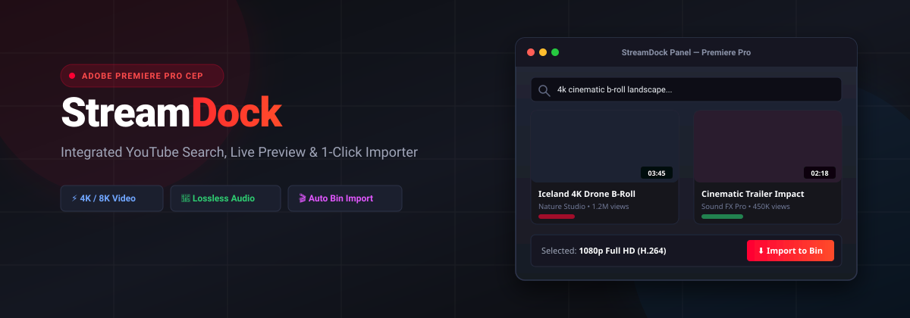
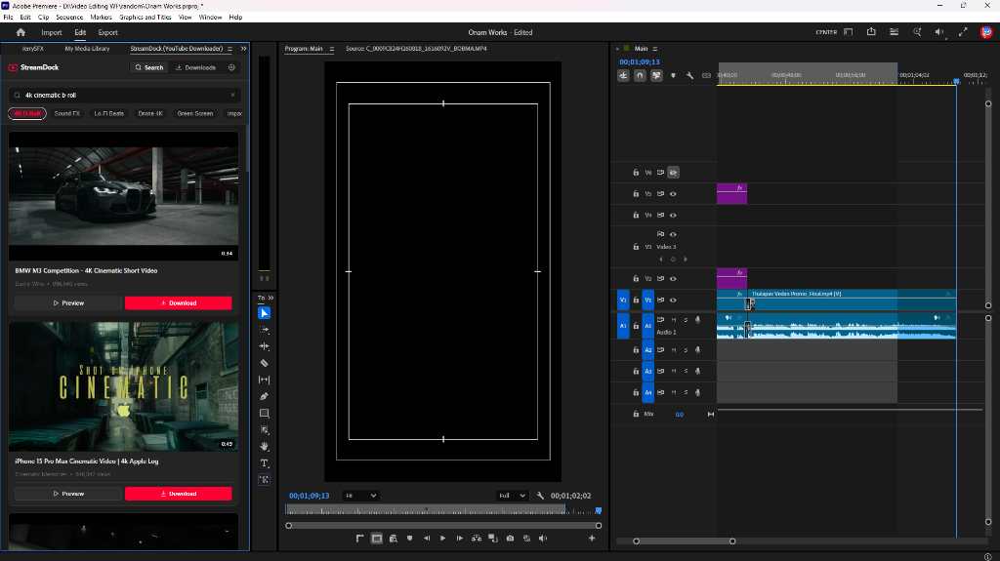
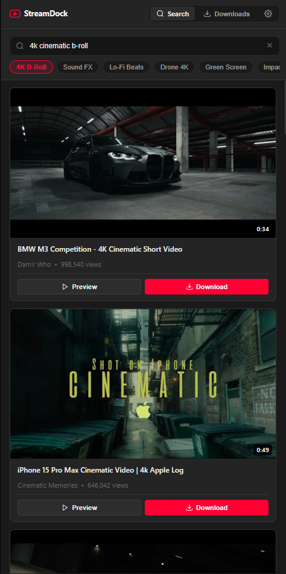
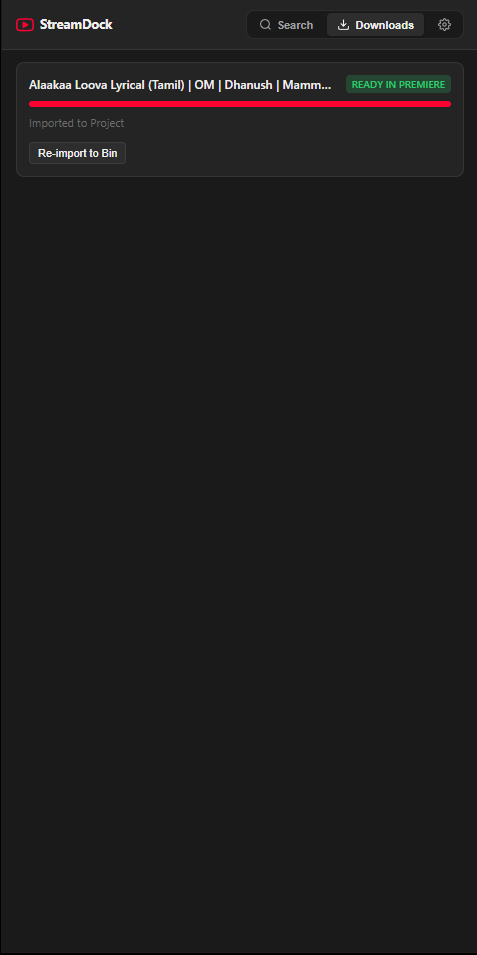
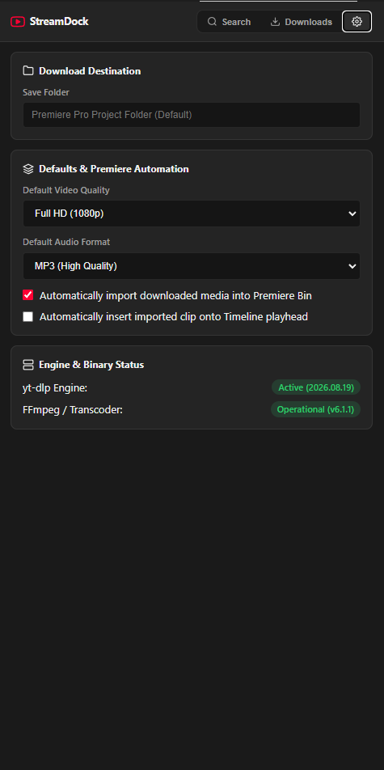
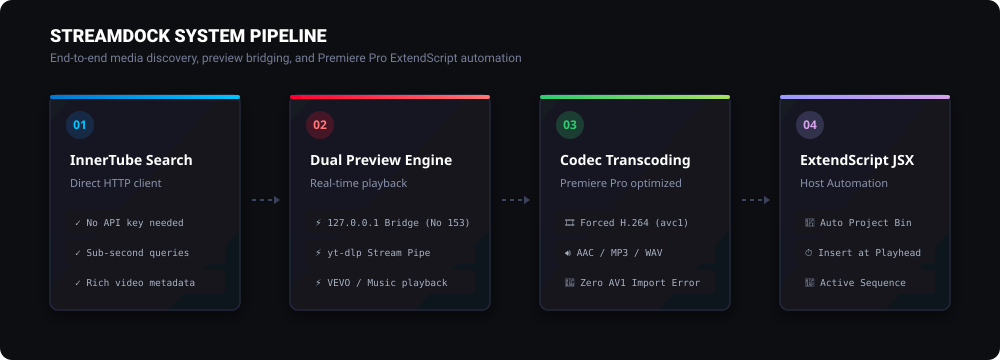

<div align="center">

  

  <br/><br/>

  [](https://www.adobe.com/products/premiere.html)
  [](https://github.com/Adobe-CEP)
  [](https://github.com/AbinVarghexe/StreamDock)
  [](LICENSE)
  [](https://github.com/AbinVarghexe/StreamDock/releases/tag/v1.0.0)

  <p align="center">
    <strong>The high-speed, integrated YouTube browser, video previewer, and media downloader built directly for Adobe Premiere Pro.</strong>
  </p>

  <p align="center">
    <a href="#-proof-of-work--ui-showcase"><strong>📸 Proof of Work</strong></a> •
    <a href="#-quick-installation-for-users"><strong>⚡ 1-Click Install</strong></a> •
    <a href="#-core-features"><strong>✨ Features</strong></a> •
    <a href="#-architecture--pipeline"><strong>🏗️ Architecture</strong></a> •
    <a href="#-troubleshooting--faq"><strong>❓ FAQ</strong></a>
  </p>

</div>

---

## 📸 Proof of Work & UI Showcase

### 🎬 Live Adobe Premiere Pro Workspace

<div align="center">
  
  <p><em>StreamDock panel docked inside Adobe Premiere Pro alongside the Program Monitor and active Sequence Timeline.</em></p>
</div>

<br/>

### 📱 In-Panel Views & Engine Status

<div align="center">
  <table>
    <thead>
      <tr>
        <th align="center" width="33.33%">🔍 Search &amp; Discovery</th>
        <th align="center" width="33.33%">📥 Automated Downloads</th>
        <th align="center" width="33.33%">⚙️ Engine &amp; Binary Status</th>
      </tr>
    </thead>
    <tbody>
      <tr>
        <td align="center" valign="top">
          
          <br/><br/>
          <sub>Filter chips, thumbnail previews, direct MP4 preview &amp; download triggers</sub>
        </td>
        <td align="center" valign="top">
          
          <br/><br/>
          <sub>Real-time download progress, "Ready in Premiere" badge &amp; Bin re-import</sub>
        </td>
        <td align="center" valign="top">
          
          <br/><br/>
          <sub>Live verification of active yt-dlp &amp; operational FFmpeg media transcoder</sub>
        </td>
      </tr>
    </tbody>
  </table>
</div>

---

## 🌟 Overview

**StreamDock** eliminates the tedious workflow of switching between web browsers, unreliable online downloaders, and file explorers. It embeds a complete YouTube browsing, real-time previewing, format transcoding, and bin-importing engine directly inside your Premiere Pro workspace.

```
                    ┌─────────────────────────┐
                    │    Adobe Premiere Pro   │
                    │   ┌─────────────────┐   │
  YouTube ─────────►│   │   StreamDock    │   │─────────► Project Bin / Timeline
  (InnerTube API)   │   │  (CEP Extension)│   │           (H.264 AVC1 + AAC Audio)
                    │   └─────────────────┘   │
                    └─────────────────────────┘
```

---

## 🚀 Quick Installation (For Users)

### ⚡ 1-Click Automated Setup (Windows)

1. Download **[`StreamDock-v1.0.0-Premiere-Pro-Extension.zip`](https://github.com/AbinVarghexe/StreamDock/releases/download/v1.0.0/StreamDock-v1.0.0-Premiere-Pro-Extension.zip)** from GitHub Releases.
2. Extract the `.zip` file.
3. Double-click **`INSTALL.bat`** *(automatically enables Adobe CEP debug mode in Windows registry and deploys extension files)*.
4. Open (or restart) **Adobe Premiere Pro**.
5. Go to the top menu:
   ```text
   Window ➔ Extensions ➔ StreamDock
   ```

---

### 🍏 Manual Installation (macOS & Windows)

<details>
<summary><strong>Click to view manual installation steps</strong></summary>

#### Step 1: Copy Files to the Adobe CEP Extensions Folder
Place the `com.streamdock.youtube.downloader` folder into:

- **Windows**:
  ```text
  %APPDATA%\Adobe\CEP\extensions\com.streamdock.youtube.downloader
  ```
- **macOS**:
  ```text
  ~/Library/Application Support/Adobe/CEP/extensions/com.streamdock.youtube.downloader
  ```

#### Step 2: Enable Adobe PlayerDebugMode
- **Windows (PowerShell)**:
  ```powershell
  10..17 | ForEach-Object { reg add "HKCU\Software\Adobe\CSXS.$_" /v PlayerDebugMode /t REG_SZ /d 1 /f }
  ```
- **macOS (Terminal)**:
  ```bash
  for v in {10..17}; do defaults write com.adobe.CSXS.$v PlayerDebugMode 1; done
  ```

</details>

---

## ✨ Core Features

| Feature | Description | Benefit |
| :--- | :--- | :--- |
| **🔍 InnerTube & Multi-Platform Search** | Fast metadata extraction via YouTube InnerTube & direct Instagram resolver. | No API keys or quota limits required. |
| **📷 Instagram Reels & Posts** | 1-Click download and preview of Instagram Reels, videos, and carousels. | Direct import of social media clips into Premiere. |
| **⚡ Dual Preview Engine** | Dynamic HTTP bridge (`127.0.0.1`) + direct stream piping. | Completely bypasses YouTube **Error 153** and embed blocks. |
| **🎞️ Smart Transcoding** | Forces Premiere-compatible **H.264 (AVC1)** & **AAC (mp4a)** codecs. | Prevents Premiere's *"Unsupported compression type 'av01'"* error. |
| **🎵 Lossless Audio** | Dedicated audio extraction to **MP3 (320kbps)**, **WAV**, and **AAC**. | Instant SFX and soundtrack import for sound designers. |
| **🎯 Timeline Automation** | Automated ExtendScript JSX execution with active sequence detection. | Drops imported media directly at your playhead position. |
| **🔐 Persistent Account Login** | Save Instagram session once — bypasses browser locks & DPAPI forever. | Download any Reel or post without repetitive logins. |
| **📦 Zero Configuration** | Bundled offline `yt-dlp` and `FFmpeg` media engines. | Ready out-of-the-box with no command-line tools needed. |

---

## 🏗️ Architecture & Pipeline

<div align="center">
  
</div>

### Component Breakdown

1. **Frontend CEP Panel (`index.html`, `css/main.css`, `js/app.js`)**:
   - Modern, responsive dark-themed user interface matching Premiere Pro CC design guidelines.
   - Live search debounce, preset filter chips, Instagram paste trigger, tab switching, and modal controls.
2. **Instagram Extractor (`js/instagram-extractor.js`)**:
   - Parses Instagram Reel and Post URLs, extracts creator handles, captions, thumbnails, and direct MP4 streams.
3. **Session Manager (`js/session-manager.js`)**:
   - Stores and generates persistent Netscape `cookies.txt` authentication files for Instagram.
   - Completely circumvents Windows Chrome/Edge DPAPI cookie encryption limitations.
4. **Local HTTP Bridge Server (`js/preview-server.js`)**:
   - Spawns a loopback server on a dynamic port (`http://127.0.0.1:<port>`).
   - Serves embedded IFrames with cross-origin headers to eliminate Error 153.
   - Provides live `/stream` endpoint for direct yt-dlp piped playback of YouTube and Instagram media.
5. **Smart Candidate Selection (`js/download-candidate-selection.js`)**:
   - Dynamically builds platform-specific `yt-dlp` format queries.
   - Prioritizes Premiere Pro native `H.264 (AVC1)` + `AAC (mp4a)` formats over AV1/VP9.
6. **ExtendScript Host Bridge (`jsx/hostscript.jsx`)**:
   - Communicates with Premiere Pro's C++ application core.
   - Auto-locates project directories, creates bins, imports media, and updates sequence tracks.

---

## 📁 Repository Structure

```text
StreamDock/
├── CSXS/
│   └── manifest.xml                     # Extension manifest, permissions & Premiere host target
├── assets/
│   ├── streamdock-banner.svg            # Hero banner illustration
│   ├── streamdock-workflow.svg          # System architecture flowchart
│   ├── streamdock-premiere-workspace.png # Landscape proof of work (Premiere Pro workspace)
│   ├── streamdock-search-view.png       # Search panel view screenshot
│   ├── streamdock-downloads-view.png    # Downloads panel view screenshot
│   └── streamdock-settings-view.png     # Settings & engine status screenshot
├── binaries/
│   └── release.json                     # Media engine version metadata
├── css/
│   └── main.css                         # Dark/Light theme styles matching Adobe CEP UI
├── js/
│   ├── app.js                           # Application lifecycle & view controller
│   ├── binary-manager.js                # Detection & validation of yt-dlp/ffmpeg
│   ├── download-candidate-selection.js  # Format prioritization & Premiere codec rules
│   ├── downloader.js                    # Download orchestration & progress reporter
│   ├── instagram-extractor.js           # Instagram Reels/Posts parser & metadata engine
│   ├── preview-server.js                # Loopback HTTP server & direct MP4 stream proxy
│   ├── session-manager.js               # Persistent Netscape cookies & account auth engine
│   └── youtube-search.js                # High-speed InnerTube API client
├── jsx/
│   └── hostscript.jsx                   # ExtendScript host bridge for Project Bin & Timeline
├── lib/
│   └── CSInterface.js                   # Adobe CEP communication SDK
├── scripts/
│   ├── download-binaries.js             # Utility to fetch fresh binary media engines
│   ├── install-staged-extension.js      # Local developer deployment script
│   └── package-extension.js             # 1-click installer & zip release bundler
├── .debug                               # Chrome DevTools remote debug configuration
├── index.html                           # Main extension UI layout
├── package.json                         # Project dependencies and script runner
└── README.md                            # Documentation
```

---

## 🛠️ Developer Commands

```bash
# 1. Clone repository
git clone https://github.com/AbinVarghexe/StreamDock.git
cd StreamDock

# 2. Download and verify binary engines
npm run download:binaries

# 3. Deploy extension locally to Premiere Pro
npm run deploy

# 4. Build release package (.zip + INSTALL.bat)
npm run package
```

---

## ❓ Troubleshooting & FAQ

<details>
<summary><strong>Q: Why does the video show "Error 153"?</strong></summary>

> **Answer**: Error 153 is caused by YouTube rejecting embed requests from `file://` origins. StreamDock automatically spins up a local bridge server at `http://127.0.0.1:<port>` with `strict-origin-when-cross-origin` referrer policy, completely solving this issue.
</details>

<details>
<summary><strong>Q: What if a VEVO / licensed video gets stuck on the thumbnail?</strong></summary>

> **Answer**: Click the **`▶ yt-dlp Stream`** button in the preview header. StreamDock will pipe the video through its direct streaming engine without relying on YouTube's web embed player.
</details>

<details>
<summary><strong>Q: Where are downloaded files saved?</strong></summary>

> **Answer**: By default, files are saved directly in your active Premiere Pro Project's folder. You can change this anytime under the **Settings** tab in the panel.
</details>

---

## 📄 License

This project is licensed under the **MIT License** — see the [LICENSE](LICENSE) file for details.

---

<div align="center">
  <sub>Built with ❤️ for video editors, content creators, and motion designers.</sub>
</div>
