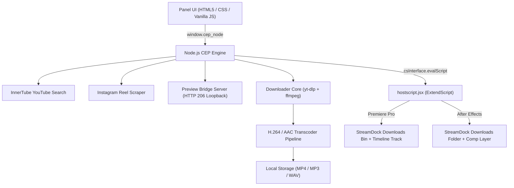

<div align="center">

  

  <br/><br/>

  [](https://www.adobe.com/products/premiere.html)
  [](https://www.adobe.com/products/aftereffects.html)
  [](https://github.com/Adobe-CEP)
  [](https://github.com/AbinVarghexe/StreamDock)
  [](LICENSE)
  [](https://github.com/AbinVarghexe/StreamDock/releases/tag/v3.0.0)

  <p align="center">
    <strong>The ultimate high-speed YouTube browser &amp; Instagram Reel downloader built natively for Adobe Premiere Pro &amp; Adobe After Effects.</strong>
  </p>

  <p align="center">
    <a href="#-whats-new-in-v300"><strong>🚀 What's New</strong></a> •
    <a href="#-proof-of-work--ui-showcase"><strong>📸 Showcase</strong></a> •
    <a href="#-quick-installation-for-users"><strong>⚡ 1-Click Install</strong></a> •
    <a href="#-features--capabilities"><strong>✨ Features</strong></a> •
    <a href="#-user-guide"><strong>📖 User Guide</strong></a> •
    <a href="#-architecture--pipeline"><strong>🏗️ Architecture</strong></a> •
    <a href="#-troubleshooting--faq"><strong>❓ FAQ</strong></a>
  </p>

</div>

---

## 🚀 What's New in v3.0.0

StreamDock 3.0 represents a major milestone with **full native cross-host architecture** engineered for both **Adobe Premiere Pro** and **Adobe After Effects**:

- **💥 Full Dual-Host Adobe Integration**: 
  - **Adobe Premiere Pro**: Automatically imports clips into dedicated `StreamDock Downloads` bins and appends footage to active sequence timelines at the playhead.
  - **Adobe After Effects**: Automatically creates and manages project folder items (`StreamDock Downloads`) and inserts footage as layers directly onto active compositions (`CompItem`).
- **🌐 `window.cep_node` Universal Runtime Bridge**: Seamless Node.js runtime resolution that guarantees `downloader.js` and `preview-server.js` run across all versions of Premiere Pro and After Effects (CSXS 7.0 through 17.0+).
- **🎛️ Authentic YouTube-Style Timeline Scrubber**: Seek to any video timestamp with real-time hover timecode tooltips, buffered track progress, volume hover slider, and keyboard hotkeys (`Space`, `j`/`l`, `m`).
- **⚡ HTTP 206 Partial Content Seeking**: Direct stream loopback proxy handles byte-range seek requests with zero playback restart bugs.
- **📷 Instagram Reels & Posts (H.264 AVC1 Guaranteed)**: All Instagram media downloads are automatically transcoded to standard H.264/AAC MP4, preventing `vp09` codec import errors in Adobe hosts.
- **🔐 Instagram Session Manager**: Store your session ID safely on your local machine for effortless access to age-restricted, licensed, or private reels.
- **🏎️ Instant UI Response**: Zero-delay modal opening, non-blocking ExtendScript resolution, and real-time download speed / ETA metrics.

---

## 📸 Proof of Work & UI Showcase

### 🎬 Live Adobe Premiere Pro & After Effects Workspaces

<div align="center">
  
  <p><em>StreamDock panel docked inside Adobe Premiere Pro &amp; Adobe After Effects alongside Project Bins/Folders and active Timeline/Comp.</em></p>
</div>

<br/>

### 📱 In-Panel Views & Engine Status

<div align="center">
  <table>
    <thead>
      <tr>
        <th align="center" width="33.33%">🔍 Search &amp; Discovery</th>
        <th align="center" width="33.33%">📥 Automated Downloads</th>
        <th align="center" width="33.33%">⚙️ Engine &amp; Binary Status</th>
      </tr>
    </thead>
    <tbody>
      <tr>
        <td align="center" valign="top">
          
          <br/><br/>
          <sub>InnerTube search, Instagram Reel paste, filter chips, video duration badges, and instant modal preview triggers</sub>
        </td>
        <td align="center" valign="top">
          
          <br/><br/>
          <sub>Real-time progress bars, download speeds, ETA counters, "Ready in Premiere/AE" indicators &amp; 1-click bin re-import</sub>
        </td>
        <td align="center" valign="top">
          
          <br/><br/>
          <sub>Custom download directory selector, default quality/audio preferences, Instagram account session manager &amp; engine health status</sub>
        </td>
      </tr>
    </tbody>
  </table>
</div>

---

## ⚡ Quick Installation for Users

### Option 1: 1-Click Automated Installer (Windows — Recommended)

1. Download the latest release: **[`StreamDock-v3.0.0-Adobe-Extension.zip`](https://github.com/AbinVarghexe/StreamDock/releases/latest)**.
2. Extract the ZIP file anywhere on your computer.
3. Open the extracted folder and double-click **`INSTALL.bat`**.
   - *The installer automatically copies the extension payload to `%APPDATA%\Adobe\CEP\extensions\` and configures `PlayerDebugMode` across Adobe CSXS 7 through 17.*
4. Open **Adobe Premiere Pro** or **Adobe After Effects**.
5. Navigate to:
   ```text
   Window ➔ Extensions ➔ StreamDock (YouTube & Instagram)
   ```

---

### Option 2: Manual Installation (Windows & macOS)

#### Step 1: Copy Extension Files to Adobe CEP Directory

Extract the extension folder (`com.streamdock.youtube.downloader`) into the appropriate directory for your operating system:

- **Windows**:
  ```text
  C:\Users\<YourUsername>\AppData\Roaming\Adobe\CEP\extensions\com.streamdock.youtube.downloader
  ```
  *(Or global path: `C:\Program Files (x86)\Common Files\Adobe\CEP\extensions\`)*

- **macOS**:
  ```text
  ~/Library/Application Support/Adobe/CEP/extensions/com.streamdock.youtube.downloader
  ```
  *(Or global path: `/Library/Application Support/Adobe/CEP/extensions/`)*

#### Step 2: Enable Adobe CEP `PlayerDebugMode`

To allow unsigned development extensions to run in Adobe CC applications:

- **Windows** (Open PowerShell as Administrator):
  ```powershell
  7..17 | ForEach-Object {
    reg add "HKCU\Software\Adobe\CSXS.$_" /v PlayerDebugMode /t REG_SZ /d "1" /f
  }
  ```

- **macOS** (Open Terminal):
  ```bash
  for i in {7..17}; do
    defaults write com.adobe.CSXS.$i PlayerDebugMode 1
  done
  ```

#### Step 3: Launch in Premiere Pro or After Effects

1. Restart your Adobe application.
2. Go to **`Window ➔ Extensions ➔ StreamDock (YouTube & Instagram)`**.
3. Dock the panel anywhere in your workspace!

---

### Option 3: Developer Setup (From Source)

```bash
# 1. Clone repository
git clone https://github.com/AbinVarghexe/StreamDock.git
cd StreamDock

# 2. Download bundled yt-dlp & ffmpeg binaries (Windows)
npm run download:binaries

# 3. Deploy extension locally to CEP directory
npm run deploy

# 4. Package distribution zip
npm run package
```

---

## ✨ Features & Capabilities

```
  ┌─────────────────────────────────────────────────────────────────────────┐
  │                            StreamDock v3.0.0                            │
  ├──────────────────────┬──────────────────────────┬───────────────────────┤
  │   🎬 Video & Audio   │   🎨 Workflow Automation │   🔒 Stability & Auth │
  ├──────────────────────┼──────────────────────────┼───────────────────────┤
  │ • 4K, 2K, 1080p, 720p│ • Premiere Pro Bins      │ • Local Session Auth  │
  │ • MP3, WAV, AAC      │ • After Effects Comps    │ • No Third-Party APIs │
  │ • YouTube InnerTube  │ • Automatic Playhead Add │ • Direct HTTP 206 CDN │
  │ • Instagram Reels    │ • Smart Naming           │ • Zero Codec Issues   │
  └──────────────────────┴──────────────────────────┴───────────────────────┘
```

| Feature | Description |
| :--- | :--- |
| **Dual-Host Support** | Native support for both **Adobe Premiere Pro** (CC 2019–2026+) and **Adobe After Effects** (CC 2019–2026+). |
| **Instant Search** | Search YouTube via embedded InnerTube protocols or paste direct URLs for YouTube Videos, Shorts, and Instagram Reels. |
| **Interactive Preview** | Stream videos directly inside the panel using either the embedded YouTube player or the built-in direct HTTP 206 MP4 stream player. |
| **Scrubber & Hotkeys** | YouTube-style progress bar with hover time previews, seek forward/back 10s (`j`/`l`), play/pause (`Space`), and mute (`m`). |
| **Resolution Selection** | Download in **4K (2160p)**, **1440p (2K)**, **1080p (Full HD)**, **720p (HD)**, or **480p**. |
| **Audio Extraction** | 1-click audio extraction to **MP3 (320 kbps)**, **WAV (Lossless PCM 24-bit)**, or **AAC**. |
| **Codec Guarantee** | All downloads (including Instagram Reels) are automatically transcoded to standard **H.264 (AVC1) / AAC**, preventing Premiere Pro / AE import errors. |
| **Automated Bin & Comp Import** | Automatically imports downloaded files into project folders and places them onto active timelines/comps. |

---

## 📖 User Guide

### 1. Searching & Browsing Media
- Enter any query into the search bar (e.g. `cinematic drone footage`, `lofi hip hop`, `sound effects`).
- Use the quick filter chips (`4K B-Roll`, `Sound Effects`, `Green Screen`, `Instagram Reel`) for 1-click curated searches.
- Paste any direct **YouTube Video**, **YouTube Short**, or **Instagram Reel** URL directly into the search bar.

### 2. Previewing Media
- Click any video card to open the **Preview & Download Modal**.
- Use the **YouTube Scrubber Bar** to scrub through the video timeline. Hovering over the scrubber displays exact timecode tooltips.
- If a video has embedding disabled by its publisher, click **`▶ yt-dlp Stream`** in the modal header to stream the video directly through the built-in HTTP proxy.

### 3. Downloading & Importing
1. Select your desired **Download Type** (`Video` or `Audio Only`).
2. Choose your **Video Resolution** (`4K`, `1440p`, `1080p`, `720p`) or **Audio Format** (`MP3`, `WAV`, `AAC`).
3. Check **"Insert to timeline / composition at playhead"** if you want the clip automatically added to your current edit.
4. Click **`Download & Import`**.
5. Switch to the **Downloads** tab to monitor progress, download speed, and ETA. The file will be imported into your Adobe project automatically upon completion!

---

## 🏗️ Architecture & Pipeline



---

## ❓ Troubleshooting & FAQ

<details>
<summary><strong>Q: The extension is not showing up in the Window &gt; Extensions menu.</strong></summary>

1. Verify that the extension folder is named `com.streamdock.youtube.downloader` and is placed in `%APPDATA%\Adobe\CEP\extensions\` (Windows) or `~/Library/Application Support/Adobe/CEP/extensions/` (macOS).
2. Ensure you have run the **`PlayerDebugMode`** registry command (or rerun `INSTALL.bat` on Windows).
3. Completely restart Premiere Pro or After Effects.
</details>

<details>
<summary><strong>Q: How do I download private or age-restricted Instagram Reels?</strong></summary>

1. Go to the **Settings (⚙️)** tab in StreamDock.
2. In the **Instagram Session ID** field, paste your session cookie (`sessionid`) from your web browser.
3. Click **Save Session**. All Instagram downloads will now authenticate using your credentials.
</details>

<details>
<summary><strong>Q: Why does a video show "Video unavailable" in preview?</strong></summary>

Some music videos and licensed content restrict third-party YouTube web embeds. Simply click the **`▶ yt-dlp Stream`** button in the modal header to stream the video directly through the built-in HTTP proxy player.
</details>

<details>
<summary><strong>Q: Are any external browser windows or third-party web services used?</strong></summary>

No. StreamDock runs 100% locally on your computer. All searches, previews, downloads, transcodes, and project imports occur directly inside Adobe Premiere Pro and After Effects.
</details>

---

## 📄 License

StreamDock is licensed under the **[MIT License](LICENSE)**.

<div align="center">
  <sub>Built with ❤️ for Video Editors, Motion Designers, and Content Creators worldwide.</sub>
</div>
